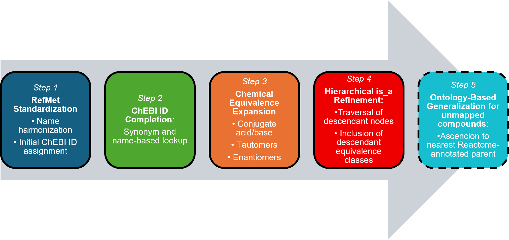

<h1 align="center">ChemEquivMapper</h1>

<p align="center">
Ontology-aware metabolite identifier harmonization and pathway mapping
for metabolomics.
</p>

<p align="center">
  
  
  
</p>

---

ChemEquivMapper is a Python package for improving metabolite-to-pathway
mapping in metabolomics studies.

The package uses RefMet standardization, ChEBI identifier completion,
chemical-equivalence relationships, and ontology traversal to reduce
semantic mismatches between metabolite annotations and pathway databases
such as Reactome and KEGG.

## Project organization

The repository is organized into several directories that separate experimental datasets, preprocessing utilities, tutorial material, and the core ChemEquivMapper package.

| Directory | Purpose |
|-----------|---------|
| **`exp_data_preprocessing/`** | Utilities for assay merging, preprocessing, feature filtering, missing-value handling, and data transformation. |
| **`experimental_data/`** | Original metabolomics datasets, including assay tables and sample metadata used for development, testing, and benchmarking. |
| **`results/`** | Example mapping summaries, pathway enrichment outputs, and exported results. |
| **`src/ChemEquiv/`** | Core ChemEquivMapper package implementing ontology-aware metabolite harmonization and pathway mapping. |
| **`tutorial_data/`** | Lightweight example datasets used by the tutorials. |
| **`tutorials/`** | Jupyter notebooks demonstrating the main ChemEquivMapper workflows. |

The relationship between these components is illustrated below:

```text
experimental_data/
        │
        │ Raw metabolomics assays
        ▼
exp_data_preprocessing/
        │
        │ Cleaning, filtering,
        │ merging and transformation
        ▼
Analysis-ready metabolite tables
        │
        ▼
src/ChemEquiv/
        │
        │ Identifier harmonization
        │ Ontology mapping
        │ Pathway enrichment
        ▼
results/
```

## Workflow

<p align="center">
  
</p>

ChemEquivMapper progressively expands metabolite mapping through five mapping stages:

| Step | Description |
|---|---|
| **Step 1** | RefMet standardization and initial ChEBI assignment |
| **Step 2** | ChEBI identifier completion using names and synonyms |
| **Step 3** | Chemical-equivalence expansion |
| **Step 4** | Ontology-guided specialization through `is_a` descendants |
| **Step 5** | Optional ontology-based generalization for unmapped compounds |

Steps 1–4 are used for stepwise pathway enrichment. Step 5 is an optional generalization stage intended to recover additional Reactome mappings.

## Tutorials

| Tutorial | Description | Run online |
|---|---|---|
| [01 — Metabolite mapping](tutorials/01_Basic_ChemEquivMapper_Workflow.ipynb) | Complete RefMet, ChEBI, chemical-equivalence, and ontology-based mapping workflow | [](https://colab.research.google.com/github/tiganouri/ChemEquivMapper/blob/main/tutorials/01_Basic_ChemEquivMapper_Workflow.ipynb) |
| [02 — Pathway enrichment](tutorials/02_Pathway_Enrichment_Analysis.ipynb) | Stepwise Reactome and KEGG over-representation analysis | [](https://colab.research.google.com/github/tiganouri/ChemEquivMapper/blob/main/tutorials/02_Pathway_Enrichment_Analysis.ipynb) |
| [03 — Multi-assay merging](tutorials/03_Merging_multiple_assay_tables.ipynb) | Align and merge multiple metabolomics assay tables | [](https://colab.research.google.com/github/tiganouri/ChemEquivMapper/blob/main/tutorials/03_Merging_multiple_assay_tables.ipynb) |

## Quickstart

### Installation

Clone the repository and install it in editable mode:

```bash
git clone https://github.com/tiganouri/ChemEquivMapper.git
cd ChemEquivMapper
pip install -e .
```

### Example

```bash
from pathlib import Path

from ChemEquiv.analysis import StepwiseORA
from ChemEquiv.context import PipelineContext

ctx = PipelineContext(repo_root=Path.cwd())

ora = StepwiseORA(ctx=ctx)

results = ora.run_all_steps(...)
```
